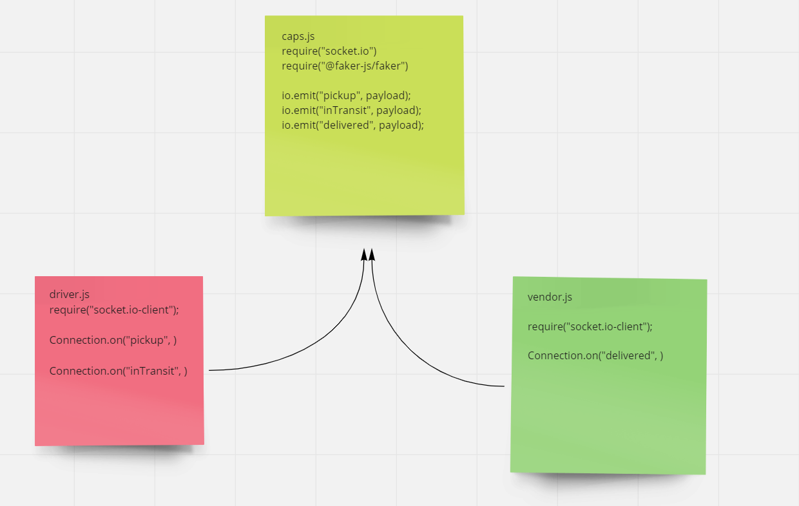

# caps_socket

this is a socket.io application has a one hub which is caps.js and two clients (driver.js and vendor.js) with three events:

- first to tell the the driver to pick an order up
- second so the driver tell that the order is being deliverd.
- last one so the driver confirms that the orded is delivered.

## UML:

